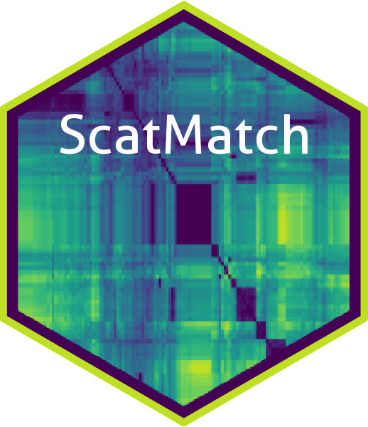

<!-- README.md is generated from README.Rmd. Please edit that file -->

```{r, include = FALSE}
knitr::opts_chunk$set(
  collapse = TRUE,
  comment = "#>",
  fig.path = "man/figures/README-",
  out.width = "100%"
)
```

# ScatMatch 

<!-- badges: start -->
[](https://www.repostatus.org/#active)
[](https://www.tidyverse.org/lifecycle/#stable)
[](https://github.com/bartesto/ScatMatch/issues/)
[](https://github.com/bartesto/ScatMatch/commits/master)
[](https://travis-ci.org/bartesto/ScatMatch)
[](https://ci.appveyor.com/project/bartesto/ScatMatch)
[](https://github.com/bartesto/ScatMatch/)
[](https://zenodo.org/badge/latestdoi/202643428)
<!-- badges: end -->

The goal of ScatMatch is to to aid error filtering from SNP genotype data and 
determine group majorities through the use of visualisations.

## Installation

You can install the development version from [GitHub](https://github.com/bartesto) with:

``` r
# install.packages("devtools")
devtools::install_github("bartesto/ScatMatch")
```
## Help Files

All functions within ScatMatch have the usual R help files, however the best place to see these and some vignettes is the [ScatMatch website](https://bartesto.github.io/ScatMatch/index.html)
