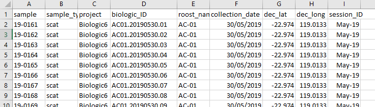
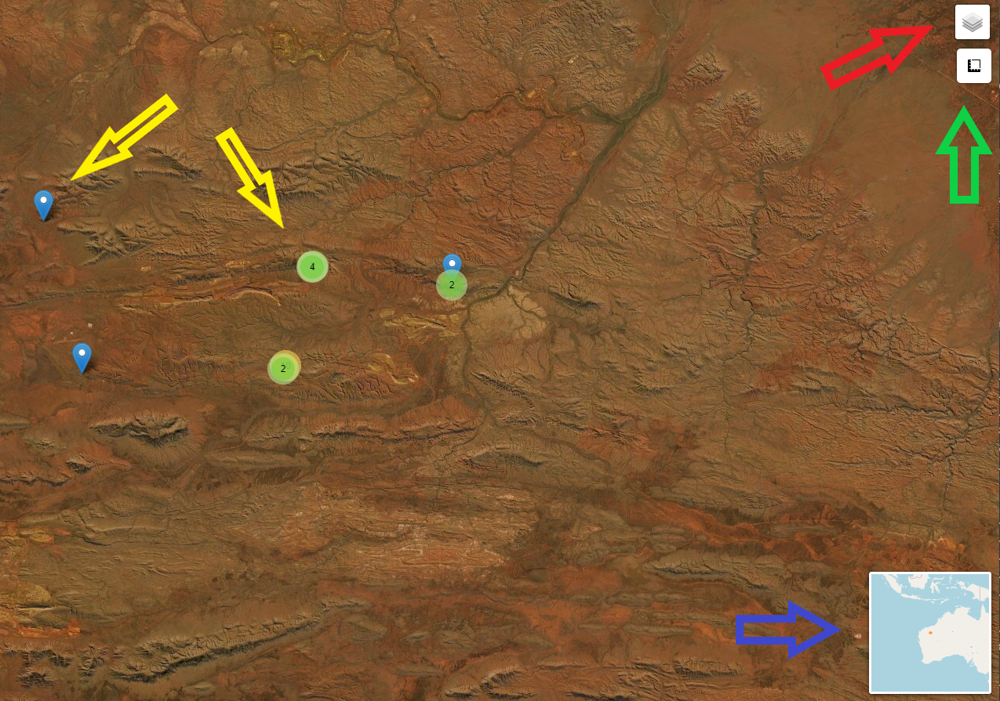

```{r, include = FALSE}
knitr::opts_chunk$set(
  collapse = TRUE,
  comment = "#>"
)
```


## Introduction
Now that groups have been assigned to the samples, the data can be summarised in 
various ways:

1. Exported to "structure" format to make it useful for other software types

2. Linked to metadata and summarised into various tables:
    + count of scats by individual, per site, per month
    + capture history per individual
    + site history
    
3. Sites and individuals are displayed in an interactive leaflet map

As mentioned in the *Getting started* article, you need to have saved a copy of 
your metadata csv to the `source` folder. Without this only item one above can 
be generated.

## Structure format
The following code exports the group majorities data to csv in structure format.
```{r, structure, eval=FALSE}
# export to structure format
structure_format(majorities_csv = "hclust_numerical_mismatch_h4_group_majorities_and_ties.csv")
```

## Summary tables
Metadata comes in all types of formats and this largely depends on who collects  
the data and what it is collected with. For the summary tables function to 
work, there are two things that the user needs to ensure:

1. That the data is in a wide format with each sample represented by one row of 
data.

2. That the following information is supplied in columns:
    + sample
    + site ID
    + field date of collection
    + latitude (WGS84)
    + longitude (WGS84)
    
The data should look something like the example shown here.




The information as specified in item 2 above could be named in many different ways  
so the user is required provide the column names that align with the parameters. 
The example below demostrates the parameters used for the metadata as displayed 
above.
```{r, summary_tables, eval=FALSE}
# produce capture history summary tables
summary_tables(groups_csv = "hclust_numerical_mismatch_h4_withGroups.csv", 
               metadata = "lookup.csv", 
               prefix = "ID_", 
               sample = "sample", 
               site_ID = "roost_name", 
               field_date = "collection_date", 
               lat = "dec_lat", 
               long = "dec_long")
```
 The other parameters include the groups csv, the name of the metadata csv and 
 the prefix. The prefix relates to the prefix that is placed in front of the 
 sample name that appears in the groups csv. The user needs to provide this so 
 that when stripped off it will match the sample names in the metadata csv. It 
 should include any underscores or hashes etc. If there is no prefix that needs 
 to be accounted for, empty quotes e.g. "" should be used.
 
## A leaflet map
 Lastly create a leaflet map. The software that handles the mapping requires all 
 coordinates to be in WGS84. This is the usual default output of most GPS systems. 
 If the map fails or produces unexpected results then this could be the issue. 
 Whoever captured or provided the data should know the coordinate reference system 
 used when logging the data.
 
 The function for the map uses the same parameters as for the summary tables.
```{r, leaf, eval=FALSE}
# export to structure format
leaflet_map(groups_csv = "hclust_numerical_mismatch_h4_withGroups.csv", 
               metadata = "lookup.csv", 
               prefix = "ID_", 
               sample = "sample", 
               site_ID = "roost_name", 
               field_date = "collection_date", 
               lat = "dec_lat", 
               long = "dec_long")
```

The output is shareable, will open in any browser and has a few features apart 
from being able to pan and zoom.




* Red arrow - toggle off and on layers (sites, individuals)

* Green arrow - distance and area widget can be used for calculations

* Blue arrow - zoomed out location map

* Yellow arrows - show sites or locations depending on which layer you are showing. 
Blue marker is a single entity. Green circle with number indicates multiple 
records at this location. Zooming in on a green circle will expand the 
site or locations so all can be interrogated (mouse over) for information.
