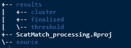

```{r, include = FALSE}
knitr::opts_chunk$set(
  collapse = TRUE,
  comment = "#>"
)
```


## Weclome to ScatMatch!
`ScatMatch` is all about making the determination of groups/individuals from SNP 
genotype data, easier by following a standardised workflow. The workflow includes 
visualisations to aid in the selection of informed parameters for filtering out errors 
and processing the raw data.

This is the first of a series of articles that will help you install and 
understand how the package should be used. All of the various functions in this 
package are intended to be run in a specific order. The articles will explain the 
workflow and cover:

* *Getting started* - Setting up an RStudio project and package installation

* *Data cleaning* - Initial steps of cleaning the raw data from the lab

* *Clustering* - Choosing parameters to finalise group membership

* *Summaries* - Producing summary information

## RStudio project
`ScatMatch` relies on operating within an RStudio project so that its various 
functions can find the relevant inputs at each stage. This abstracts away the 
need for the user to deal with long and unwieldy file paths.

If you are familiar with RStudio projects then just make sure you create one and 
work within it. If you're not sure read on.

First up open up RStudio and in the top right hand corner (circled in red) click 
and open the dialogue box displayed below.

You have the option to either create the project in a new directory (blue tick) 
or use an existing one (green tick). I would suggest starting fresh with a new one. 
From your selection follow the prompts to create a new project. 

If you are familiar with version control and GitHub feel free to either check out 
a repo or create a git repo. If all of that is alien to you then a standard new 
project is what you are after.

You can call your project whatever you like and you will know you have been 
successful as the name will now be displayed where that red circle was in the 
picture above.

## Install ScatMatch and load it
You only need to install the package once (unless you are updating it). The 
package lives on GitHub so you will need the package `devtools` to install. To get 
started open a new R file and copy and run the code below.
```{r, install, eval=FALSE}
# Install and load ScatMatch
# install.packages("devtools")
devtools::install_github("dbca-wa/ScatMatch")
library(ScatMatch)
```

It's likely that there are a few other packages that you may not have installed. 
If so you will get a prompt to install them.

## Set up a folder structure
Next you will need to set up a folder structure to contain the inputs and outputs 
for the various functions you will run.
```{r, folders, eval=FALSE}
# Make some folders
workspace()
```

This will make the following folders. Note the RStudio project that the example 
was run in was called ScatMatch_processing and the .Rproj file will be named as 
per your choice of project name.


Don't worry if you run it again down the track, it won't write over any data 
that may be stored there.

The directory to pay attention to is `source` which is where you need to put 
your input data which should be in csv format. You need your raw data from the 
lab and it should look something like below.


And you will also need a csv format copy of your metadata for your samples which should look 
something like this.


This metadata or lookup table will be discussed further in the *Summaries* article.

Congratulations! You are now ready to get the raw data ready for processing. 
Follow along in the next article, *Data cleaning*.
