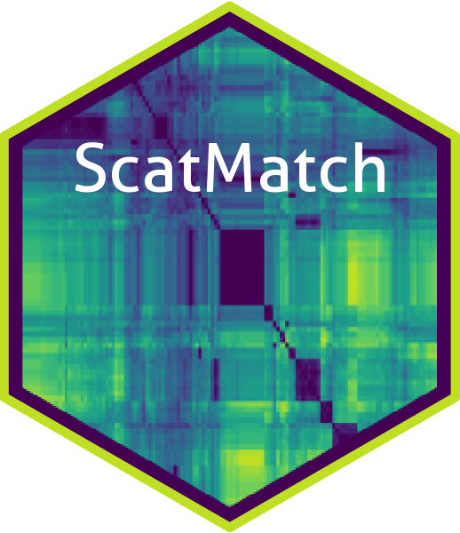

```{r, include = FALSE}
knitr::opts_chunk$set(
  collapse = TRUE,
  comment = "#>"
)
```


## Introduction
Clustering is about finding similarities between samples so that they can be 
grouped which in essence differentiates individuals within the data. The functions 
here will use hierarchical clustering methods on a calculated mismatch scores.

## Finding dissimilarities
The function below creates and stores a lot of data which is why you need to 
assign it to an object. The list object that it creates, stores among other data, 
mismatch scores and dissimilarity matrices. Depending on how large your raw data 
is, the function can take a while to run. To give some indication of progress it 
will print to screen which mismatch score it is calculating from the total number 
of possible sample combinations.
```{r, dissim, eval=FALSE}
# create dissimilarities and store in an object
dis_list <- dissimilarity(filtered_alleles = "numerical_alleles_filtered_at0.8_mt0.2.csv",
                          errors = "sample_error_results.csv")
```
Note that the filtered alleles data input is the final dataset that was created 
in the last article.

## Visualisation for (h)
The task at hand now is to determine a height (h) at which to "cut" the data. 
This makes the most sense when you look at the dendrogram plot. The height will 
determine how many groups are created from the data and thereby how many individuals 
there in the sampling. 

The code section below will generate a dendrogram, an elbow plot, a histogram of 
mismatches, a heat map and a heat map of correlations. The heat maps are plotly 
objects which enable the user to interrogate the plot using the mouse cursor on 
the html outputs. These are all saved to the `results/cluster/` directory.
```{r, clust_plots, eval=FALSE}
# create some visualisations to determine (h)
dendro_plot(dist = dis_list)
elbow_plot(dist = dis_list, maxh = 10)
freq_hist(dist = dis_list)
heat_plot(dist = dis_list)
heat_cor_plot(dist = dis_list)
```

Note the only parameter to tweak is the maxh or maximum height (h) for the elbow 
plot. Larger values will make a longer x-axis but most plots will stabilise with 
a value of 10 (default).

Another way of visualising is to generate histograms of the "within" group and 
"between" groups mismatches at various values of (h). Overlap between the 
distributions can indicate misassignment of group inclusion. These plots can be 
thought of as genetic distance plots. In the function to follow: 

* lt - is the lower percentile of the "between" groups distribution and in the 
plots is represented by a blue dashed line.

* ut - is the upper percentile of the "within" group distribution and in the plots 
is represented by a red dashed line.

The area between these two values is the overlap feature space and by running 
many simulations the probability of distributions overlapping here determines 
the misassignment probability. 
```{r, misass, eval=FALSE}
# misassignment plots and 
misassign(dist = dis_list, maxh = 10, lt = 0.005, ut = 0.995)
```
The function defaults to the lt and ut values as above and is supported in the 
literature. An example of a plot.


The plots indicate how many individuals and the probability of misassignment 
at the given (h). The (h) value is captured in the file name of the plot. A csv 
file, **misassignment_table.csv**,  is also saved which summarises these values 
at each (h).

## Create the groups
After looking at all of the plots an (h) value should be apparent and its now 
time to apply it to the data and create some groups. Make sure you adjust (h) to 
your value.
```{r, majority, eval=FALSE}
# create groups
majorities(dist = dis_list, 
           h = 4, 
           filtered_alleles = "numerical_alleles_filtered_at0.8_mt0.2.csv",
           errors = "sample_error_results.csv")
```

This will create 2 new csv datasets in `results/cluster/`:

* **hclust_numerical_mismatch_h4_group_majorities_and_ties.csv** - this data is 
organised by group, and shows the sample membership, the numerical alleles, majority 
vote of the alleles, whether there were any ties in the vote and average 
amplification rate.

* **hclust_numerical_mismatch_h4_withGroups.csv** - this is just the numerical 
allele data with groups assigned.

Note that the (h) value used to create the cut forms part of the file names to 
avoid confusion if multiple runs are undertaken.

Lastly, because it's nicer to look at colour formatted html tables instead of 
csv files, running the function below will make a **majorities_table.html** saved 
to the `results/cluster/` directory.
```{r, majority_html, eval=FALSE}
# majorities html scrollable table
majorities_html(majorities_csv = "hclust_numerical_mismatch_h4_group_majorities_and_ties.csv")
```

That completes the clustering work. The next article, *Summaries*, shows how to 
make a map linking the samples to your metadata and some other summary data.
