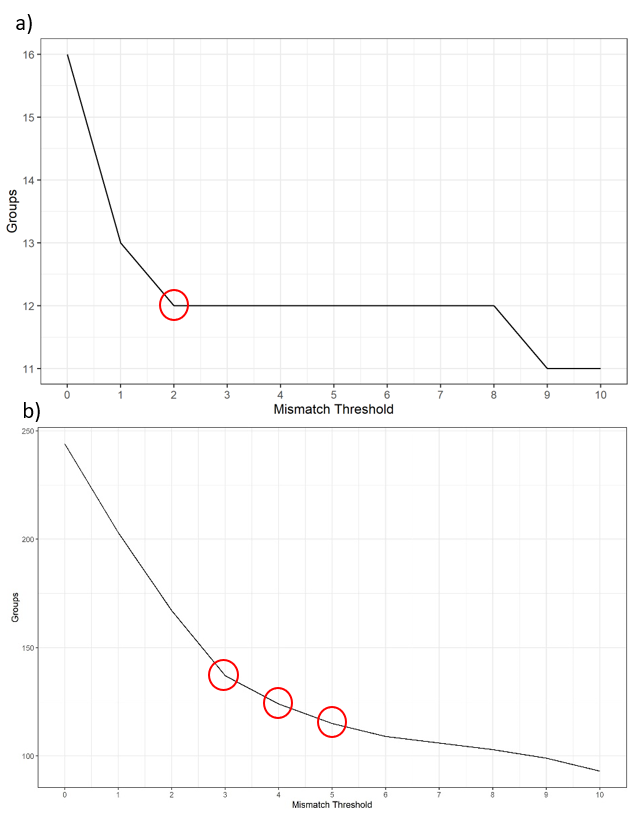
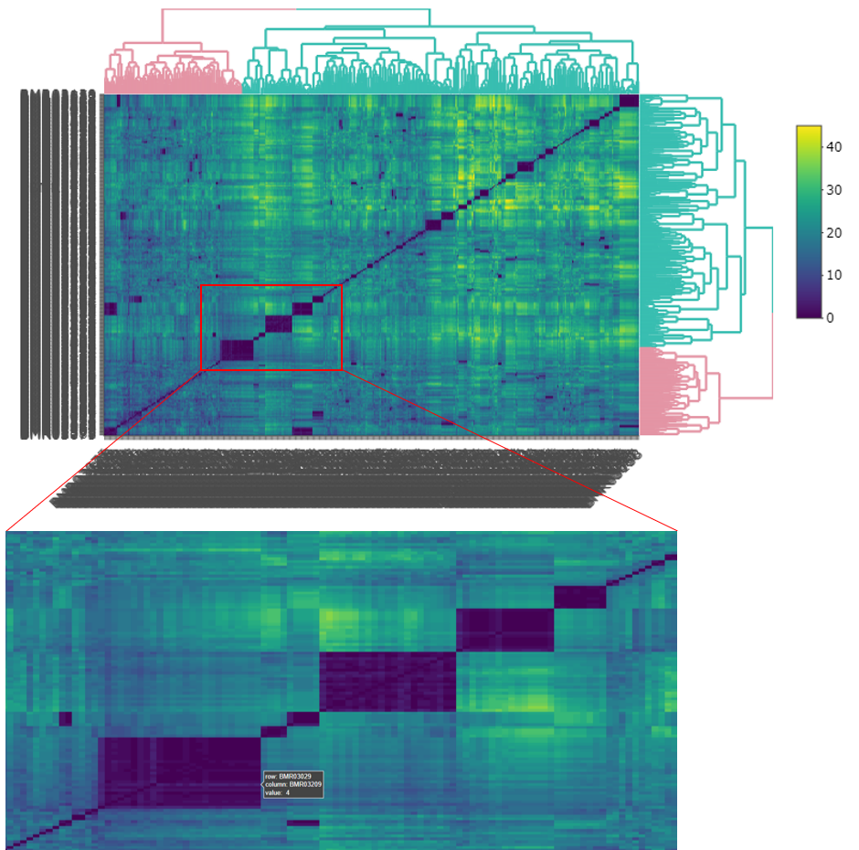
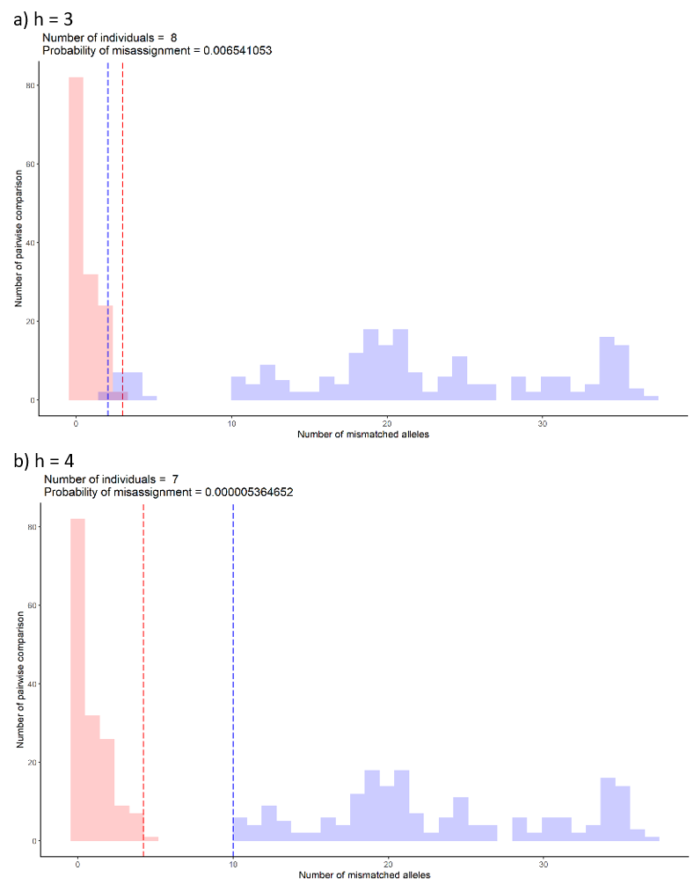

```{r, include = FALSE}
knitr::opts_chunk$set(
  collapse = TRUE,
  comment = "#>"
)
```


## Introduction
Clustering is about finding similarities between samples so that they can be 
grouped which, in essence differentiates individuals within the data. The functions 
here will use hierarchical clustering methods on a calculated mismatch scores.

## Finding dissimilarities
The function below creates and stores a lot of data which is why you need to 
assign it to an object. The list object that it creates, stores among other data, 
mismatch scores and dissimilarity matrices. 
```{r, dissim, eval=FALSE}
# create dissimilarities and store in an object
dis_list <- dissimilarity(filtered_alleles = "numerical_alleles_filtered_at0.8_mt0.2.csv",
                          errors = "sample_error_results.csv")
```
Note that the filtered alleles data input is the final dataset that was created 
in the last article.

## Visualisation for (h)
The task at hand now is to determine a height (h) at which to "cut" the data or 
define the maximum number of allele differences allowed to allocate samples as 
the same individual. This makes the most sense when you look at the dendrogram 
plot. The height will determine how many groups are created from the data and 
thereby how many individuals there in the sampling. 

The code section below will generate a dendrogram, an elbow plot, a histogram of 
mismatches, a heat map and a heat map of correlations. The heat maps are plotly 
objects which enable the user to interrogate the plot using the mouse cursor on 
the html outputs. These are all saved to the `results/cluster/` directory.
```{r, clust_plots, eval=FALSE}
# create some visualisations to determine (h)
dendro_plot(dist = dis_list)
elbow_plot(dist = dis_list, maxh = 10)
freq_hist(dist = dis_list)
heat_plot(dist = dis_list)
heat_cor_plot(dist = dis_list)
```

Note the only parameter to tweak is the maxh or maximum height (h) for the elbow 
plot. Larger values will make a longer x-axis but most plots will stabilise with 
a value of 10 (default).

Another way of visualising is to generate histograms of the within group and 
between groups mismatches at various values of (h). Overlap between the 
distributions can indicate misassignment of group inclusion. These plots can be 
thought of as genetic distance plots. In the function to follow: 

* lt - is the lower percentile of the "between" groups distribution and in the 
plots is represented by a blue dashed line.

* ut - is the upper percentile of the "within" group distribution and in the plots 
is represented by a red dashed line.

The area between these two values is the overlap feature space and by running 
many simulations, the probability of distributions overlapping here determines 
the misassignment probability. The function defaults to the lt and ut values as 
below and is supported in the literature. 
```{r, misass, eval=FALSE}
# misassignment plots and 
misassign(dist = dis_list, maxh = 10, lt = 0.005, ut = 0.995)
```

The (h) value is captured in the file name of the plot. A csv 
file, **misassignment_table.csv**,  is also saved which summarises these values 
at each (h).

## Selecting (h)
The elbow graph, heat map and misassignment graph are designed to help users identify
the most likely (h). These graphs may not agree on a specify value and it is up 
to the user to pick this value. The choice of (h) depends on quality of the data 
and how conservative the user is in selecting (h). For instance, the user may 
choose to be more stringent if the data is very good quality and the error rate 
between replicates is low. However, if the data quality is not great i.e. 
incomplete, high error rate etc, the user may want to adopt a more conservative 
choice knowing that he/she is likely to underestimate the true number of 
individuals. On the other hand, being too stringent may over estimate the true 
number by over splitting samples that belong to the same individual. In addition, 
the user may want to try different filter settings for both loci and individual 
genotypes to see if the grouping would change with different settings. This final 
decision should be accompanied by sexing results (to be updated) and the 
metadata to see if the grouping makes biological sense. The decision of choosing 
the most likely (h) for each type of graph is described below.

### Elbow graph
To determine a suitable (h), the user needs to look for the largest drop of group 
number as well as the value when the graph starts to flatten out. For the example 
below, a) shows a mismatch threshold of 2 would be a suitable value to select. 
However, with some data such as b) where the graph doesn't show a clear drop. 
Thresholds of 3, 4, and 5 are all potential. You would need other types of graphs 
to make the decision.  



### Heat maps
In the interactive version of the heat map, you can zoom in to the area of 
interest by dragging a box around the area. You can hover the mouse over the 
edge of each deep blue coloured box to inspect how many allele differences between 
inside and outside the box. Try a few boxes, especially those that are large in 
size, then compare them with more distinct smaller boxes to get an idea of what
would be a potential (h).



### Misassignment graphs
The misassignment graph plots frequency of allelic differences within and between 
groups assigned by selected (h). The graph assumes allelic differences between 
groups to follow a binomial distribution (blue). Any allelic differences falling 
outside the distribution are likely to be caused by other means such genotyping 
errors or variation between samples from the same individual (red). At each (h), 
the graph will indicate how many groups or individuals are detected. This number 
is the same number as shown in the elbow graph. The probability of misassignment  
is also calculated which can be converted into the percentage of error. 

For example, the probability of assigning samples to a wrong group is 0.006% for 
graph a) compared to a smaller number, 0.000005% for graph b). The maximum 
suggested percentage is 0.5%. 

Overlap of the upper 0.995 percentile (red dashed line) and lower 0.005 percentile 
(blue dashed line) suggest the possibility of misassigning samples to between and 
within group distributions. The location of the overlap suggests which distribution 
the samples will likely to misassign to. For example, if the overlap falls in the 
within group distribution (red), the samples from the between group distribution 
(blue) are likely to be misassigned to the within group distribution (red). From 
the example of the graph below, the most likely (h) would be 4 because a clear 
separation between within (red) and between (blue) distributions.




## Create the groups
After looking at all of the plots, an (h) value should be apparent and it is now 
time to apply it to the data and create some groups. Make sure you adjust (h) to 
your value.
```{r, majority, eval=FALSE}
# create groups
majorities(dist = dis_list, 
           h = 4, 
           filtered_alleles = "numerical_alleles_filtered_at0.8_mt0.2.csv",
           errors = "sample_error_results.csv")
```

This will create 2 new csv datasets in `results/cluster/`:

* **hclust_numerical_mismatch_h4_group_majorities_and_ties.csv** - this data is 
organised by group, and shows the sample membership, the numerical alleles, majority 
vote of the alleles, whether there were any ties in the vote and average 
amplification rate.

* **hclust_numerical_mismatch_h4_withGroups.csv** - this is just the numerical 
allele data with groups assigned.

Note that the (h) value used to create the cut forms part of the file names to 
avoid confusion if multiple runs are undertaken.

Lastly, to aid visualisation of allele differences within each group, colour 
formatted html tables can be created by running the function below. This will 
save a file called **majorities_table.html** in the `results/cluster/` directory.
```{r, majority_html, eval=FALSE}
# majorities html scrollable table
majorities_html(majorities_csv = "hclust_numerical_mismatch_h4_group_majorities_and_ties.csv")
```

That completes the clustering work. The next article, *Summaries*, shows how to 
make a map linking the samples to your metadata and some other summary data.
