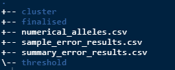
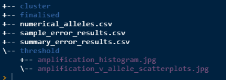
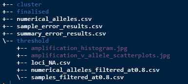

```{r, include = FALSE}
knitr::opts_chunk$set(
  collapse = TRUE,
  comment = "#>"
)
```


## Introduction
This section of the workflow is about reading in the raw data and formatting it 
in such a way so that errors can be summarised and the alleles are exported as 
numerical values. This data can then be visualised in various ways to help 
determine appropriate amplification and missingness thresholds which will clean 
the data set prior clustering, covered in the *Clustering* article.

## Generate error summaries and numerical data
To run the next function you will need to know three things which are all 
parameters for the function. These are: 

* filename - the name of the raw data csv that is in the source directory.

* replicates - TRUE or FALSE. Does your raw data have replicate samples?

* suffix - if your data has duplicates it will have a suffix at the end of the 
sample name. Include it here with any separators. Ignore if no duplicates.

Here is the function, change the parameters to suit your needs.
```{r, data_in, eval=FALSE}
# Make some clean data
gen_errors(filename = "CAGRF20021407_raw.csv", 
           replicates = TRUE, 
           suffix = "_dup")
```

After running this there should be 3 new csv files in the `results` directory.


* **numerical_alleles.csv** - raw data converted to numerical values

* **sample_error_results.csv** - average amplification, allele error, locus error, 
allelic dropout and false allele values per sample.

* **summary_error.csv** - gives average and standard error of all the sample errors 
combined.

## Apply thresholds to the data
Next step is to visualise the data to get an understanding of what amplification 
value should be used to reduce the dataset. Run the below.
```{r, amp_plots, eval=FALSE}
# amplification scatterplots
amp_splots()
# amplification histogram
amp_hist()
```

After running this there will be 2 plots saved as jpg's as below.


Note that they are in the `threhold` folder as that is the current task. 
They will also be printed to screen.

After inspecting the plots and choosing an appropriate amplification threshold 
(at) run the next function to filter the data. Make sure you apply your at value.
```{r, amp_thresh, eval=FALSE}
# apply the amplification threshold
amp_threshold(at = 0.8)
```

When that is run it will filter out some samples from the data and will print to 
screen how many you will lose. It will generate 3 new csv files as per below.


* **loci_NA.csv** - a summary of the proportion of NA's per locus in the filtered 
data.

* **numerical_alleles_filtered_at0.8.csv** - numerical alleles now filtered to 
the at value.

* **samples_filtered_at0.8.csv** - the samples that were filtered from the dataset 
and what their respective average amplification rates were.

Next visualise the "missingness" by plotting a histogram.
```{r, miss_histo, eval=FALSE}
# missingness histogram
miss_hist()
```

The functions draw on the proportions of NA's dataset and creates and saves a 
histogram to the  `results/threshold/` directory.

After inspecting the histogram and choosing an appropriate missingness threshold 
(mt) run the next function to further filter the data. Make sure you apply your 
own at and mt values.
```{r, fin_thresh, eval=FALSE}
# missingness threshold
miss_threshold(at = 0.8, mt = 0.2)
```

Now the folder structure should look like this.


**numerical_alleles_filtered_at0.8_mt0.2.csv** is the numerical alleles now 
filtered to the at and mt values. Note that the at and mt values will always be 
saved within the name so that you can keep track of multiple versions. This dataset 
will be used for all the work to follow so its important that you are happy with 
it before progressing.

Now that there is a clean dataset, clustering is next and you can read about it 
in the *Clustering* article.
